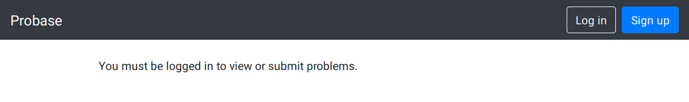
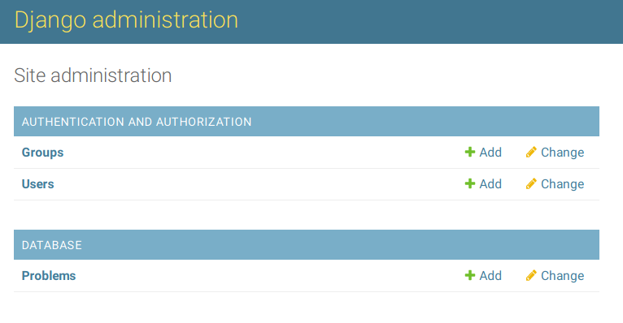
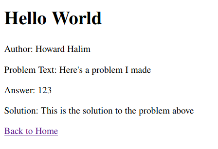

# Probase: CMIMC's Problem Database

## Getting Started

### Setup
1. Make sure you have [Python](https://www.python.org/downloads/) installed on your computer.
2. Clone this repository: `git clone https://github.com/CMU-Math/probase.git`
3. In the newly created folder, run `pip install -r requirements.txt`
4. Then run Django migrations: `python manage.py migrate`
5. Start the Django development server: `python manage.py runserver`
6. Go to [http://127.0.0.1:8000/home/](http://127.0.0.1:8000/home/) in your browser, and you should see the home page. It should look like the image below:

    

### Django Admin and User setup
If you click the new problem link and try to submit a problem, you'll get an error. This is because each problem requires an author, which must be an instance of [Django's User class](https://docs.djangoproject.com/en/3.0/ref/contrib/auth/) (if you want to see how a problem is defined, see [database/models.py](https://github.com/CMU-Math/probase/blob/master/database/models.py). Since we haven't implemented any user accounts yet, the problem author defaults to the first user account (line 20 of [database/views.py](https://github.com/CMU-Math/probase/blob/master/database/views.py) if you're curious). The error happens because there aren't any user accounts yet. Here's how to fix it:

1. Run `python manage.py createsuperuser`, and enter any username, email, and password.
2. Go to [http://127.0.0.1:8000/admin/](http://127.0.0.1:8000/admin/) and login with the account
you just created.
3. You should see the Django admin site:
    
    
    Click on "Users", then select the account you just created, enter a first and last name, and save the changes.
4. Go back to the home page ([http://127.0.0.1:8000/home/](http://127.0.0.1:8000/home/)) and submit a new problem. It should create a problem detail page at [http://127.0.0.1:8000/problem/1/](http://127.0.0.1:8000/problem/1/) which shows the details of the new problem, and the author should be the name you entered.

    

### Tutorials
For anyone new to either Python or Django, here are some tutorials.

Python Tutorials:
- [https://www.learnpython.org/](https://www.learnpython.org/)
- [https://thepythonguru.com/](https://thepythonguru.com/)
- [https://pythonbasics.org/](https://pythonbasics.org/)

Django Tutorials:
- [https://simpleisbetterthancomplex.com/series/beginners-guide/1.11/](https://simpleisbetterthancomplex.com/series/beginners-guide/1.11/)
- [https://docs.djangoproject.com/en/3.0/intro/tutorial01/](https://docs.djangoproject.com/en/3.0/intro/tutorial01/)
- [Django Documentation](https://docs.djangoproject.com/en/3.0/topics/)
